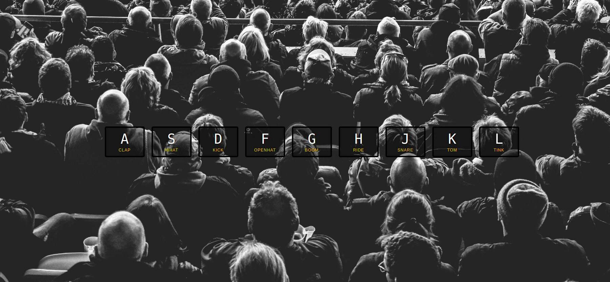

# javaScript-drum-kit 

> A simple website allows the user to press nine different keys and listen to different sound associated with changes in the size and border of the keys , when the user press different keys during short period  ,the user will hear a sound like a drum. 

## Table of contents
* [General info](#general-info)
* [Screenshots](#screenshots)
* [Technologies](#technologies)
* [Setup](#setup)
* [Features](#features)
* [Status](#status)
* [Inspiration](#inspiration)
* [Contact](#contact)

## General info

The web site is created by `Wes Bos`, his code is written in a single `HTML` file. The main goal is learning how to separate the code into different files, in the repository the single `HTML` file has been divided in to `HTML`,`CSS` and five `JS` files.

## Screenshots


## Technologies
* JavaScript
* HTML
* CSS
* VSC code


## Setup
open index.html in your browser and enjoy! playing the drum 

## Code Examples

```js
**
 * play a music when the user press the nine keys , which are connected to audio files 
 * @param {Event} event - triggered whenever a user press one of the nine keys 
 */

 export function playSound(e) {
    const audio = document.querySelector(`audio[data-key="${e.keyCode}"]`);
    const key = document.querySelector(`div[data-key="${e.keyCode}"]`);
    if (!audio) return;

    key.classList.add('playing');
    audio.currentTime = 0;
    audio.play();
  };
```


## Features
List of features ready and TODOs for future development

* 
* 
* 

To-do list:

* 
* 

## Status
Project is: _in progress_

## Inspiration
The project is created by `Wes Bos`

## Contact
Refracted  by [@samirm00] 