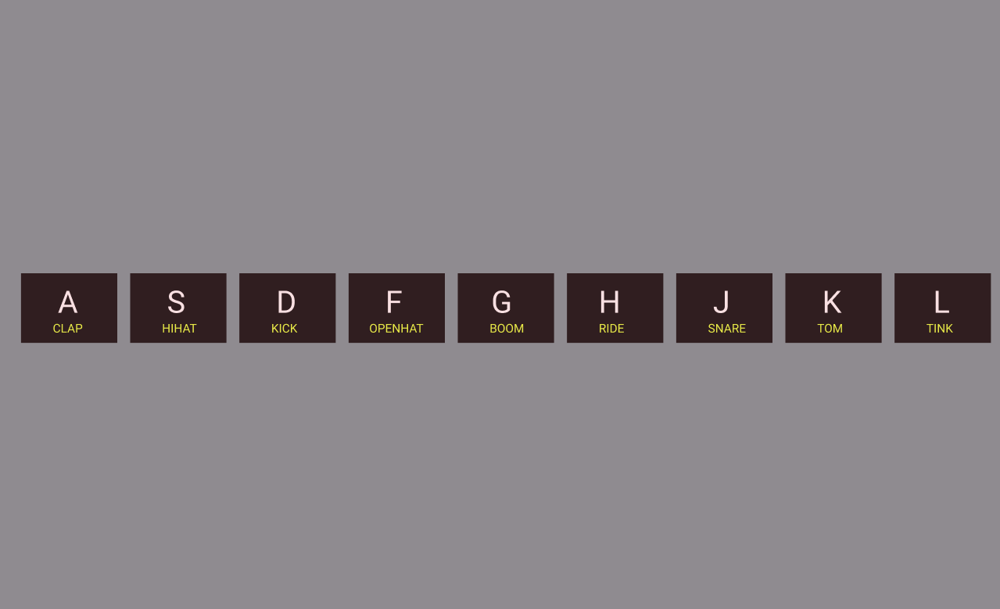

# javaScript-drum-kit

A simple website allows the user to press nine different keys and listen to different sound associated with changes in the size and border of the keys , when the user press different keys during short period  ,the user will hear a sound like a drum.

---

## User Story Dependencies

[Story Dependency Diagram](../img/userStories.png)

---

## WIREFRAME

---

## 0.Setup

- fork the `javaScript30-starter`
- create a project board
- create milestones and issues

---

## X. initializing the we page  :

> how much work do you think this step will take?  medium 

> The web page interface:

- **As a user I want to open the `javaScript-drum-kit` so I can press keys and listen to the keys sound.**
- When I open the web page `javaScript-drum-kit` I see 9 grey blackish square each one contains a letter and a word,
  
- first one contain the letter 'A' and the word 'CLAB'
- second one contain the letter 'S' and the word 'HIHAT'
- third one contain the letter 'D' and the word 'KICK'
- fourth one contain the letter 'F' and the word 'OPENHAT'
- fifth one contain the letter 'G' and the word 'BOOM'
- sixth one contain the letter 'H' and the word 'RIDE'
- seventh one contain the letter 'J' and the word 'SNARE'
- eighth one contain the letter 'K' and the word 'TOM'
- last one contain the letter 'L' and the word 'TINK'
### REPO

- This user story is developed on branch `1-keys`.
- This branch is merged to `master` branch after the acceptance criteria have been checked off.

### DOM 

- `index.html`: create `div` element  with class keys and inside it a `div` with a  child `kbd` for each key

### style

- `style1.css`: style the background and each key , so they have square grey blackish background 

## X.Play drum :

> how much work do you think this step will take?  medium 

> use keyboard keys to play drum-kit  :

- **As a user I want to press the 9 keys so I can  play and listen  to different music with related to each key**
 - When I press the 'A' key , I hear the sound 'CLAB' and the key move , size and border change.
 - When I press the 'S' key , I hear the sound 'HIHAT' and the key move , size and border change.
 - When I press the 'D' key , I hear the sound 'KICK' and the key move , size and border change.
 - When I press the 'F' key , I hear the sound 'OPENHAT' and the key move , size and border change.
 - When I press the 'G' key , I hear the sound 'BOOM' and the key move , size and border change.
 - When I press the 'H' key , I hear the sound 'RIDE' and the key move , size and border change.
 - When I press the 'J' key , I hear the sound 'SNARE' and the key move , size and border change.
 - When I press the 'K' key , I hear the sound 'TOM' and the key move , size and border change.
 - When I press the 'L' key , I hear the sound 'TINK' and the key move , size and border change.
### REPO

- This user story is developed on branch `2-sound`.
- This branch is merged to `master` branch after the acceptance criteria have been checked off.

### DOM 

- `index.html`: create `span` for each `div` child with class sound.
- create `audio` element with the source and `data-key`
- add links to the `init.js`

### style

- `style1.css`:
- Add transition properties to the keys class and add playing class so when the a key is pressed  it will change the size and border 
- add class `playing` to use with functions and class `class sound` to style the word 

### JavaScript

- craete folder `handlers`
- add `playSound.js` file contains a function `playSound()`
- add `removeTransition.js` file contains a function `removeTransition()`

- craete folder `listeners`
- add `keydown.js` file contains an even listener call the function  `playSound()`
- add `transitioned.js /` file contains an even listener call the function  `removeTransition()`

